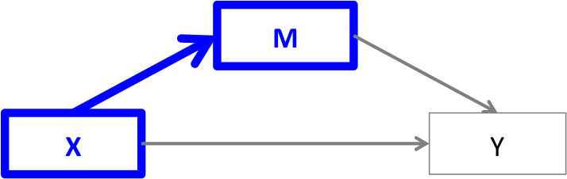
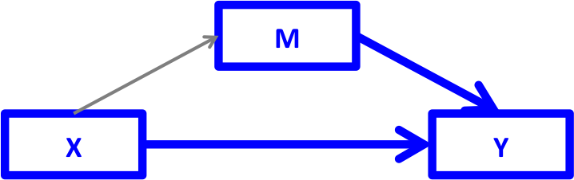
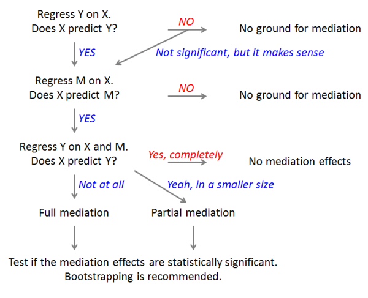

```{r setup, include=FALSE}
knitr::opts_chunk$set(echo = TRUE, fig.align="center")
```

## Installing required packages

These are the required packages to reproduce this document

```{r install, eval=FALSE}
install.packages("mediation")
```

## Illustrating example

Previous studies have shown that loss of chromosome Y (LOY) is associated with cancer. We hypothesize that: 

X (LOY) -> Y (cancer).

One may think, however, that LOY is not the real reason why cancer risk 
increases. For instance, we can hypothesize that LOY downregulate gene expression and this transciptomic change  may increases cancer risk: 

X (LOY) -> M (gene expression) -> Y (cancer). 

This hypothesis can be supported from literature. The gene TMSB4Y located in chromosome Y has an aberrant effect in cellular morphology that reduces cell proliferation. Thus, a down-regulation of this gene can lead to cell proliferation and the consequent tumor growth that end up with cancer.
                                                                  This is a typical case of mediation analysis. Gene expression is a mediator that explains the underlying mechanism of the relatioship between LOY and cancer. 

Let us load a dataset containing information about LOY, genes and tumoral status belonging to TCGA project and lung cancer.

```{r load}
load("c:/Juan/CREAL/GitHub/Curso_R_avanzado/Day04-DAG_mediation/Mediation/data/lusc.Rdata")
```

## How to analyze mediation effects?

Before we start, keep in mind that, as any other regression analysis, mediation 
analysis does not imply causal relationships unless it is based on experimental design. Solutions to analysing mediation which overcome unmeasured or residual confounding, reverse causation and measurement error include the use of instrumental variable methods, of which Mendelian randomization is a form
(see this [paper](https://www.ncbi.nlm.nih.gov/pmc/articles/PMC5036871/)).  

The following shows the basic steps for mediation analysis suggested by Baron & Kenny (1986). A mediation analysis is comprised of three sets of regression: X -> Y, X -> M, and X + M -> Y. This can be performed by using any statistical sowfare, even Stata! ;-)

### Step 1

<center>{width=50%}</center>

Fit a regression model $Y=\beta_0+\beta_1X+\epsilon$. Is $\beta_1$ significant? We want X to affect Y. If there is no relationship between X and Y, there is nothing to mediate. Although this is what Baron and Kenny originally suggested, this step is controversial. Even if we don't find a significant association between X and Y, we could move forward to the next step if we have a good theoretical background about their relationship. See Shrout & Bolger (2002) for details.

In our example, as LOY has also been associated with age, the model is adjusted for this variable

```{r mod1}
mod1 <- glm(Cancer ~ LOY + age , data=lusc, family="binomial")
summary(mod1)
```  

### Step 2

<center>{width=50%}</center>

Fit the model $M=\beta_0+\beta_2X+\epsilon$. Is $\beta_2$ significant? 
We want X to affect M. If X and M have no relationship, M is just a third 
variable that may or may not be associated with Y. A mediation makes sense only if X affects M. In our example we should fit:

```{r mod2}  
model.M <- glm(TTTY15 ~ LOY + age, data=lusc)
summary(model.M)
```

### Step 3

<center>{width=50%}</center>

Fit the model $Y=\beta_0+\beta_4X+\beta_3M+\epsilon$. Is $\beta_4$
non-significant or smaller than before? We want M to affect Y, 
but X to no longer affect Y (or X to still affect Y but in a smaller magnitude).
If a mediation effect exists, the effect of X on Y will disappear 
(or at least weaken) when M is included in the regression. The effect of X on Y goes through M. Let us verify this by using our data

```{r mod3}
model.Y <- glm(Cancer ~ LOY + TTTY15 + age, data=lusc, family="binomial")
summary(model.Y)
```


If the effect of X on Y completely disappears, M fully mediates between X and Y
(full mediation). If the effect of X on Y still exists, but in a smaller 
magnitude, M partially mediates between X and Y (partial mediation). 
The example shows .... 
Note that a full mediation rarely happens in practice.

## Statistical testing
Once we find these relationships, we want to see if this mediation effect is 
statistically significant (different from zero or not). To do so, there are 
two main approaches: the Sobel test (Sobel, 1982) and bootstrapping 
(Preacher & Hayes, 2004). In R, you can use sobel() in 'multilevel' package for the Sobel test and mediate() in 'mediation' package for bootstrapping (and others).

sobel only requires the three variables of interest: the predictor (X), the mediating variable (M) and the outcome (Y)

```{r sobel, eval=FALSE}
sobel(X, M, Y)
```

This has some drawbacks

* Variables must be continuous
* Models cannot be adjusted by other covariates

mediate() takes two model objects as input (X -> M and X + M -> Y) and we 
need to specify which variable is the treatment (LOY) and a mediator 
(gene expression). For bootstrapping, set 'boot' = TRUE and 'sims' to at least 1000. After running it, look for ACME (Average Causal Mediation Effects) in the 
results and see if it's different from zero. 

```{r mediation}
library(mediation)
res <- mediate(model.M, model.Y, treat='LOY', mediator='TTTY15')
summary(res)
```

ADE corresponds to direct effect, while ACME stands for the mediation effect.

To sum up, here's a flowchart for mediation analysis (created by Bommae Kim, University of Virginia Library)



